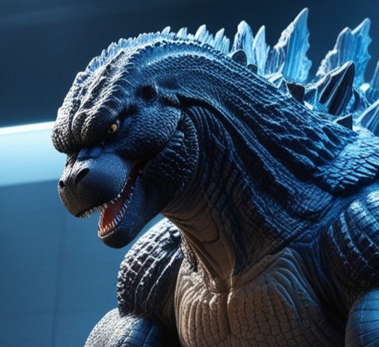

    

   

-------

  

# Projeto artigo técnico gerado por I.A.s

 > ℹ️ **NOTE:**   Este repositório foi criado durante aula sobre uso de IA para criação de artigos técnicos refinados. Curso assistido na plataforma da [DIO](https://dio.me).

Projeto com o objetivo de gerar um artigo técnico prático com um layout rico, e de fácil compreensão. Focado em promover habilidades na elaboração de prompts mais assertivos.

## 💻 Tecnologias utilizadas no projeto

- [ChatGPT](https://chat.openai.com/) - para título e conteúdo
- [Leonardo.ai](https://leonardo.ai/) - para gerar imagens
- [Canva](https://canva.com) - Para formatação de banners e Layouts

## 📄 Prompts e ferramentas

 
ChatGPT：

|   Ação   | prompt                                                                                                                                                                                                                                                                                                                                                                   |
| :------: | ------------------------------------------------------------------------------------------------------------------------------------------------------------------------------------------------------------------------------------------------------------------------------------------------------------------------------------------------------------------------ |
|  título  | Crie 10 headlines para nomes de artigos sobre o assunto File System                                                                                                                                                                                                                                                                                                      |
| conteúdo | Atue como um especialista em node.js demonstrando a utilização do File System. Esta demonstração será através de texto para ebook {REGRAS} Explique sempre de uma maneira simples. Evite termos muito técnicos pois o conteúdo deve ser entendível por todos os públicos. Sempre traga exemplos de código em contextos reais , sempre deixe um título alusivo ao tópico. |

 
 
 

Leonardo AI:

|  Ação  | prompt                                                                                                                                                                                                                                                                                                                                                                                                                                                                                                                                                                                    |
| :----: | ----------------------------------------------------------------------------------------------------------------------------------------------------------------------------------------------------------------------------------------------------------------------------------------------------------------------------------------------------------------------------------------------------------------------------------------------------------------------------------------------------------------------------------------------------------------------------------------- |
| Imagem | Em uma representação deslumbrantemente vívida, a figura imponente de Godzilla coloca delicadamente um documento de papel dentro de um diretório amarelo brilhante, configurado contra uma interface digital de computador. As escamas robustas da majestosa criatura brilham sob a luz artificial, acentuando sua presença intimidadora. A atenção aos detalhes nesta imagem digitalmente renderizada é extraordinária, capturando o imenso poder e precisão de Godzilla em uma composição hipnotizante que imerge o espectador no mundo moderno da tecnologia e da maravilha monstruosa. |

## ✨ Features

- Conteúdo gerado via ChatGPT e revisado por humano.
- Imagens geradas via Leonardo AI 

 

## 👨‍💻 Monster Developer

    
    
&nbsp&nbsp&nbsp&nbsp&nbspAllan Guimarães 
    &nbsp&nbsp&nbsp
    </a>&nbsp;|&nbsp;
    <a href="https://www.linkedin.com/in/allanguimaraes/">LinkedIn</a>

&nbsp;&nbsp;

  

 